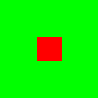

# Getting Started
### Spinning Square [](https://travis-ci.org/TyOverby/Piston-Tutorial)

In this tutorial, I hope to get you from an empty Cargo project to having a
window with a rotating square in it.
This tutorial does ___not___ explain concepts used in the game, as those
will be covered by other tutorials.
This tutorial only covers project setup and contains a sample "game" simply
to test the build environment.


I assume that you have installed Rust and Cargo, and have already built a
hello-world project with Cargo.
If you haven't met these criteria, please read the first few chapters of
[The Rust Guide](http://doc.rust-lang.org/guide.html) and come back once
you've finished.



#### At this stage

* You should be able to run the commands `rustc -v`
* You should be able to run the commands `cargo -V`

If you have failed either of these, please review the getting started
guide and make sure that you have the latest versions of `rustc` and `cargo`.

## Installing Dependencies

Parts of the Piston project depend on native C libraries.  For example, in
order to display a window and hook it up to an OpenGL context, we can use
either GLFW or SDL2 as the implementation of our windowing system.

The rest of this tutorial uses GLFW for windowing, so we will need to
install its native library.

### GLFW on OSX

If you use [Homebrew](http://brew.sh), this is as simple as
`brew install homebrew/versions/glfw3 static`.  That's it.  You're done.

Otherwise, follow the steps for setting it up on Linux.

Honestly, it's probably easier to just install Homebrew and then follow the
homebrew instructions.

### GLFW on Linux

Install the system level dependencies `xorg-dev` and `libglu1-mesa-dev`
using apt-get, yum, or by building from source.

0. Make sure that `/usr/local/lib/` is on your static library path.
   To do this, in your `.bashrc`, add the line:
   `export LD_LIBRARY_PATH='/usr/local/lib'`
1. Install CMake.  CMake is the program that is used to build GLFW
   from scratch.
2. Install git.  Git is used to download GLFW.
3. `cd` to some empty working directory.
4. `git clone https://github.com/glfw/glfw.git`
5. `cd glfw`
6. `git checkout 3.0.3`
7. `cmake -DCMAKE_C_FLAGS=-fPIC -DGLFW_BUILD_EXAMPLES=OFF -DGLFW_BUILD_TESTS=OFF -DGLFW_BUILD_DOCS=OFF .`
8. `make`
9. `sudo make install`

#### At this stage

* `echo $LD_LIBRARY_PATH` should contain `/usr/local/lib`.
* `ls /usr/local/lib/` should contain `libglfw3.a`.


### GLFW on Windows
TODO


## Setting Up The Project

Alright, if everything is set up correctly, it's time to get a Cargo project
built, and Piston installed.

```bash
mkdir getting-started
cd getting-started
touch Cargo.toml
```

Now in your favorite editor, lets add project settings and dependencies to
`Cargo.toml`.


```
[package]

name = "getting-started"
version = "0.0.0"
authors = ["<your name here>"]

[dependencies.piston]

git = "https://github.com/PistonDevelopers/piston.git"

[dependencies.glfw_game_window]

git = "https://github.com/PistonDevelopers/glfw_game_window.git"

[dependencies.graphics]

git = "https://github.com/PistonDevelopers/rust-graphics.git"

[dependencies.opengl_graphics]

git = "https://github.com/PistonDevelopers/opengl_graphics.git"

[[bin]]

name = "game"
path = "./src/game.rs" # We will create this file in the next section.
```

You might be thinking that this is a lot of dependencies for such a simple
example application.
This is because of how the Piston Projects are set up.
The `piston` and `graphics` libraries are able to do a lot of work by
themselves, but they are made to be completely independent of a
backing implementation.
For example, when it comes to displaying a window and getting keyboard events
in a cross-platform maner, you can use either GLFW or SDL2.
GLFW and SDL2 are both C and C++ cross-platform libraries for creating windows
with an OpenGL context.
In this tutorial I chose GLFW, so you will notice that in the cargo file, we
imported `glfw_game_window`.
`opengl_graphics` is another backend that implements the interface defined in
`graphics`.
`graphics` is a 2d graphics API that doesn't care about how things are
*actually* drawn to the screen.
If you implement the `graphics` interface yourself, you could route it
through directx, or render straight to a png.
In this tutorial, we are rendering using OpenGL, so we'll use `opengl_graphics`.

The pattern of "interface" and "backend" is very common with Piston Projects.
While other game engines might encompass more functionality, we prefer to have
many libraries that are separated and extendable, but also work well when
combined.


## Writing Some Code

Ok, time for some actual programming.

First create the source directory and a file use as the entry point for
our application.

```bash
mkdir src
touch src/game.rs
```

Now in your favorite editor edit `src/game.rs`.

```rust
extern crate graphics;
extern crate piston;
extern crate glfw_game_window;
extern crate opengl_graphics;

use glfw_game_window::GameWindowGLFW;
use opengl_graphics::Gl;

use piston::{
    Game,
    GameWindowSettings,
    GameIteratorSettings,
    RenderArgs,
    UpdateArgs
};

use graphics::{
    Context,
    AddRectangle,
    AddColor,
    Draw,
    RelativeTransform2d,
};

pub struct App {
    gl: Gl,       // OpenGL drawing backend.
    rotation: f64 // Rotation for the square.
}

impl Game for App {
    fn render(&mut self, args: &RenderArgs) {
        // Set up a context to draw into.
        let context = &Context::abs(args.width as f64, args.height as f64);
        // Clear the screen.
        context.rgba(0.0,1.0,0.0,1.0).draw(&mut self.gl);

        // Draw a box rotating around the middle of the screen.
        context
            .trans((args.width / 2) as f64, (args.height / 2) as f64)
            .rot_rad(self.rotation)
            .rect(0.0, 0.0, 50.0, 50.0)
            .rgba(1.0, 0.0, 0.0,1.0)
            .trans(-25.0, -25.0)
            .draw(&mut self.gl);
    }

    fn update(&mut self, args: &UpdateArgs) {
        // Rotate 2 radians per second.
        self.rotation += 2.0 * args.dt;
    }
}

fn main() {
    // Create a GLFW window.
    let mut window = GameWindowGLFW::new(
        GameWindowSettings {
            title: "Hello Piston".to_string(),
            size: [800, 800],
            fullscreen: false,
            exit_on_esc: true
        }
    );

    // Some settings for how the game should be run.
    let game_iter_settings = GameIteratorSettings {
        updates_per_second: 60,
        max_frames_per_second: 60
    };

    // Create a new game and run it.
    let mut app = App { gl: Gl::new(), rotation: 0.0 };
    app.run(&mut window, &game_iter_settings);
}
```

## Compiling and running.

Awesome!  Now that we have some game code, lets get it running!
With Cargo, downloaing dependencies and building the application is as
simple as running `cargo build`.

If all goes well, you should have the binary `game` inside the `target`
directory.

Run it by executing `./target/game`.

On your screen you should have a rotating square that looks like this:


