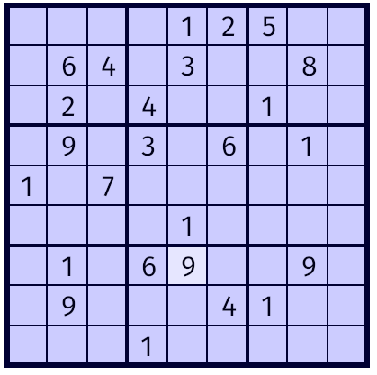

# Sudoku tutorial
by Sven Nilsen, 2017

## Chapter 6

Now we will render the numbers.
We need two new methods on the `Gameboard` struct:

```rust
  /// Gets the character at cell location.
  pub fn char(&self, ind: [usize; 2]) -> Option<char> {
      Some(match self.cells[ind[1]][ind[0]] {
          1 => '1',
          2 => '2',
          3 => '3',
          4 => '4',
          5 => '5',
          6 => '6',
          7 => '7',
          8 => '8',
          9 => '9',
          _ => return None,
      })
  }

  /// Set cell value.
  pub fn set(&mut self, ind: [usize; 2], val: u8) {
      self.cells[ind[1]][ind[0]] = val;
  }
```

Add a new folder "assets/" to the "sudoku/" project folder.

Copy "FiraSans-Regular.ttf" and "LICENSE" to the [assets](./assets/) folder.

Change the `GameboardController::event` to the following:

```rust
  /// Handles events.
  pub fn event<E: GenericEvent>(&mut self, pos: [f64; 2], size: f64, e: &E) {
      use piston::input::{Button, Key, MouseButton};

      if let Some(pos) = e.mouse_cursor_args() {
          self.cursor_pos = pos;
      }
      if let Some(Button::Mouse(MouseButton::Left)) = e.press_args() {
          // Find coordinates relative to upper left corner.
          let x = self.cursor_pos[0] - pos[0];
          let y = self.cursor_pos[1] - pos[1];
          // Check that coordinates are inside board boundaries.
          if x >= 0.0 && x <= size && y >= 0.0 && y <= size {
              // Compute the cell position.
              let cell_x = (x / size * 9.0) as usize;
              let cell_y = (y / size * 9.0) as usize;
              self.selected_cell = Some([cell_x, cell_y]);
          }
      }
      if let Some(Button::Keyboard(key)) = e.press_args() {
          if let Some(ind) = self.selected_cell {
              // Set cell value.
              match key {
                  Key::D1 => self.gameboard.set(ind, 1),
                  Key::D2 => self.gameboard.set(ind, 2),
                  Key::D3 => self.gameboard.set(ind, 3),
                  Key::D4 => self.gameboard.set(ind, 4),
                  Key::D5 => self.gameboard.set(ind, 5),
                  Key::D6 => self.gameboard.set(ind, 6),
                  Key::D7 => self.gameboard.set(ind, 7),
                  Key::D8 => self.gameboard.set(ind, 8),
                  Key::D9 => self.gameboard.set(ind, 9),
                  _ => {}
              }
          }
      }
  }
```

Import `CharacterCache` in "gameboard_view.rs":

```rust
use graphics::character::CharacterCache;
```

Add a new field `text_color` to `GameboardViewSettings`:

```rust
  /// Selected cell background color.
  pub selected_cell_background_color: Color,
  /// Text color.
  pub text_color: Color,
```

Set the value of `text_color` in `GameboardViewSettings::new`:

```rust
      selected_cell_background_color: [0.9, 0.9, 1.0, 1.0],
      text_color: [0.0, 0.0, 0.1, 1.0],
```

Add a `glyphs` parameter to `GameboardView::draw` and import the trait `Transformed`:

```rust
  /// Draw gameboard.
  pub fn draw<G: Graphics, C>(
      &self,
      controller: &GameboardController,
      glyphs: &mut C,
      c: &Context,
      g: &mut G
  )
      where C: CharacterCache<Texture = G::Texture>
  {
    use graphics::{Image, Line, Rectangle, Transformed};
    ...
  }
```

The trait constraint `CharacterCache<Texture = G::Texture>` makes sure that
the texture type matches the type used by the graphics backend.

Draw characters after drawing selected cell background:

```rust
    // Draw selected cell background.
    if let Some(ind) = controller.selected_cell {
        let cell_size = settings.size / 9.0;
        let pos = [ind[0] as f64 * cell_size, ind[1] as f64 * cell_size];
        let cell_rect = [
            settings.position[0] + pos[0], settings.position[1] + pos[1],
            cell_size, cell_size
        ];
        Rectangle::new(settings.selected_cell_background_color)
            .draw(cell_rect, &c.draw_state, c.transform, g);
    }

    // Draw characters.
    let text_image = Image::new_color(settings.text_color);
    let cell_size = settings.size / 9.0;
    for j in 0..9 {
        for i in 0..9 {
            if let Some(ch) = controller.gameboard.char([i, j]) {
                let pos = [
                    settings.position[0] + i as f64 * cell_size + 15.0,
                    settings.position[1] + j as f64 * cell_size + 34.0
                ];
                if let Ok(character) = glyphs.character(34, ch) {
                    let ch_x = pos[0] + character.left();
                    let ch_y = pos[1] - character.top();
                    let text_image = text_image.src_rect([
                        character.atlas_offset[0],
                        character.atlas_offset[1],
                        character.atlas_size[0],
                        character.atlas_size[1],
                    ]);
                    text_image.draw(character.texture,
                                    &c.draw_state,
                                    c.transform.trans(ch_x, ch_y),
                                    g);
                }
            }
        }
    }
```

The `let ch_y = pos[1] - character.top();` has a negative sign because the
y-axis in font coordinates points upwards while the y-axis in drawing coordinates points downwards.

In "main.rs", import `Filter`, `TextureSettings` and `GlyphCache`:

```rust
use opengl_graphics::{OpenGL, Filter, GlGraphics, GlyphCache, TextureSettings};
```

Before the event loop, load the font:

```rust
  let gameboard = Gameboard::new();
  let mut gameboard_controller = GameboardController::new(gameboard);
  let gameboard_view_settings = GameboardViewSettings::new();
  let gameboard_view = GameboardView::new(gameboard_view_settings);

  let texture_settings = TextureSettings::new().filter(Filter::Nearest);
  let ref mut glyphs = GlyphCache::new("assets/FiraSans-Regular.ttf", (), texture_settings)
      .expect("Could not load font");
```

We use nearest neighbor filter to show sharper glyphs.
Notice `ref mut` can be used to create a mutable reference.
This saves us from putting `&` in front of an argument.

Pass the `glyphs` object to `gameboard_view.draw`:

```rust
gameboard_view.draw(&gameboard_controller, glyphs, &c, g);
```

When typing `cargo run` in the Terminal window, you should be able to fill
in the numbers:


