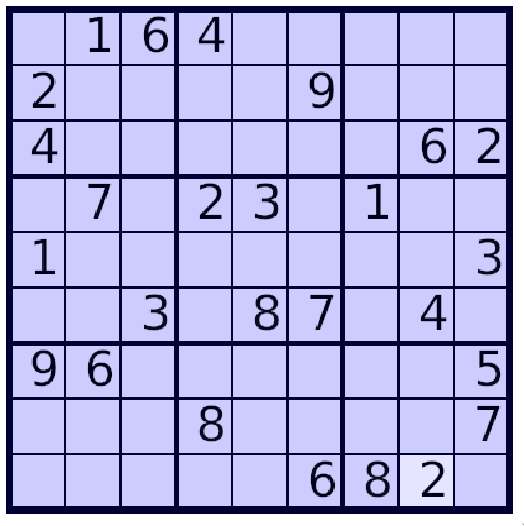

# Sudoku tutorial
by Brent Westbrook, 2022

## Chapter 7

While it's pretty exciting to put numbers into a grid, we need a couple more
features to call it Sudoku. In this chapter we'll implement a function to read
in an [SDM file](https://www.sudocue.net/fileformats.php), which contains a full
puzzle on a single line. For example, the line

```
016400000200009000400000062070230100100000003003087040960000005000800007000006820
```

represents the puzzle



Then in the next chapter, we'll add the code to check the puzzle for valid input
so that it can actually be playable.

### Load the SDM file

To load a game from a file, we'll add an associated `load_sdm` function on our
`Gameboard` struct:

```rust
    /// Load a new game board from the SDM file in `filename`
    pub fn load_sdm(filename: &str) -> Self {
        let data = read_to_string(filename).expect("failed to read SDM file");
        let mut cells = [[0; SIZE]; SIZE];
        let mut row = 0;
        let mut col = 0;
        for c in data.chars() {
            if col == SIZE {
                col = 0;
                row += 1;
            }
            cells[row][col] = c.to_digit(10).unwrap() as u8;
            col += 1;
        }
        Self { cells }
    }
```

We simply read the whole file directly into a string, then iterate over the
string as an iterator of characters and convert each one to a digit. Since
`to_digit` returns a `u32` we cast it to a `u8` to match the type of our board.
We keep track of the row and column of each index using the aptly-named `row`
and `col` variables. This is not the most robust load function (one big
annoyance is that we didn't handle any annoying whitespace, including trailing
newlines), but it will work for now. Technically, SDM files can also contain
multiple puzzles, so you can fix these issues as an exercise.

#### Testing

To make sure our `load_sdm` function is working at all, it's a good idea to
write at least a small test. Rust makes this very easy. Add the following code
to the bottom of your `gameboard.rs` file:

```rust
#[cfg(test)]
mod tests {
    use super::*;

    #[test]
    fn load_sdm() {
        let got = Gameboard::load_sdm("static/puzzle.sdm");
        let want = Gameboard {
            cells: [
                [0, 1, 6, 4, 0, 0, 0, 0, 0],
                [2, 0, 0, 0, 0, 9, 0, 0, 0],
                [4, 0, 0, 0, 0, 0, 0, 6, 2],
                [0, 7, 0, 2, 3, 0, 1, 0, 0],
                [1, 0, 0, 0, 0, 0, 0, 0, 3],
                [0, 0, 3, 0, 8, 7, 0, 4, 0],
                [9, 6, 0, 0, 0, 0, 0, 0, 5],
                [0, 0, 0, 8, 0, 0, 0, 0, 7],
                [0, 0, 0, 0, 0, 6, 8, 2, 0],
            ],
        };
        assert_eq!(got, want);
    }
}
```

To call the `assert_eq!` macro on a struct, it has to implement the traits
`PartialEq` and `Debug`, so you'll also need to add the `#derive` line:

```rust
/// Stores game board information.
#[derive(Debug, PartialEq)]
pub struct Gameboard {
```

to your `Gameboard` definition to generate implementations of these traits.
After that, you can run the test with `cargo test`. If everything goes well,
back in `main.rs`, you can replace your `Gameboard::new()` call with
`Gameboard::load_sdm(static/puzzle.sdm)`.

### Protecting loaded digits

One thing you might notice if you run your new `main.rs` file is that you can
overwrite the digits we just loaded in! We need to fix that if we actually want
to play the loaded Sudoku without cheating. Basically we need to tag each
element of our `Gameboard` with a value that says whether or not we can change
it in the future so that when we call our `set` method we do nothing if the cell
was loaded. We also probably want to make the loaded cells impossible to select
in our `GameboardController::event` method and give them a special background
color in our `GameboardView::draw` method.

The easiest way to do all of this is to change the definition of our
`Gameboard.cells` field. Instead of holding a single `u8`, we can make it hold a
`Cell` struct, which in turn contains a `u8` and a `bool` saying whether or not
it was loaded:

```rust
/// Stores information for a single `Gameboard` cell
#[derive(Debug, PartialEq)]
pub struct Cell {
    value: u8,
    loaded: bool,
}
```

Note that we have to make it implement the same traits as `Gameboard`.

Now we can change our `Gameboard` definition to

```rust
/// Stores game board information.
#[derive(Debug, PartialEq)]
pub struct Gameboard {
    /// Stores the content of the cells.
    /// `0` is an empty cell.
    pub cells: [[Cell; SIZE]; SIZE],
}
```

This will trigger a cascade of issues in our project. We can handle the issues
in our `Gameboard::new` function and our initial `let mut cells` call inside of
`load_sdm` by also deriving the `Default` trait, so that instead of `cells: [[0;
SIZE]; SIZE]`, we can just say cells: [[Cell::default(); SIZE]; SIZE]. However,
the `Default` trait requires its implementors to be `Copy`, so we also have to
derive the `Copy` trait on `Cell`. Finally, to derive `Copy`, we have to implement `Clone`, so the final derive call for `Cell` is

```rust
#[derive(Clone, Copy, Debug, Default, PartialEq)]
```

To finish propagating this change, we need to update our `load_sdm` function to
build `Cell`s instead of just `u8`s

```rust
/// Load a new game board from the SDM file in `filename`
pub fn load_sdm(filename: &str) -> Self {
	let data = read_to_string(filename).expect("failed to read SDM file");
	let mut cells = [[Cell::default(); SIZE]; SIZE];
	let mut row = 0;
	let mut col = 0;
	for c in data.chars() {
		if col == SIZE {
			col = 0;
			row += 1;
		}
	    let value = c.to_digit(10).unwrap() as u8;
		cells[row][col] = Cell {
			value,
			loaded: value != 0,
		};
		col += 1;
	}
	Self { cells }
}
```

our `char` method to access the `value` field:

```rust
/// Gets the character at cell location.
pub fn char(&self, ind: [usize; 2]) -> Option<char> {
	Some(match self.cells[ind[1]][ind[0]].value {
		1 => '1',
		2 => '2',
		3 => '3',
		4 => '4',
		5 => '5',
		6 => '6',
		7 => '7',
		8 => '8',
		9 => '9',
		_ => return None,
	})
}
```

our `set` method to check the `loaded` status before setting a value, and to set
the `value` field:

```rust
/// Set cell value.
pub fn set(&mut self, ind: [usize; 2], val: u8) {
	if !self.cells[ind[1]][ind[0]].loaded {
		self.cells[ind[1]][ind[0]].value = val;
	}
}
```

and our `load_sdm` test to

```rust
#[test]
fn load_sdm() {
	let got = Gameboard::load_sdm("puzzles/puzzle.sdm");
	let want = Gameboard::from_cells([
		[0, 1, 6, 4, 0, 0, 0, 0, 0],
		[2, 0, 0, 0, 0, 9, 0, 0, 0],
		[4, 0, 0, 0, 0, 0, 0, 6, 2],
		[0, 7, 0, 2, 3, 0, 1, 0, 0],
		[1, 0, 0, 0, 0, 0, 0, 0, 3],
		[0, 0, 3, 0, 8, 7, 0, 4, 0],
		[9, 6, 0, 0, 0, 0, 0, 0, 5],
		[0, 0, 0, 8, 0, 0, 0, 0, 7],
		[0, 0, 0, 0, 0, 6, 8, 2, 0],
	]);
	assert_eq!(got, want);
}
```

where I added the convenience function `from_cells` to avoid having to wrap each
element of the array in a `Cell`:

```rust
pub fn from_cells(cells: [[u8; SIZE]; SIZE]) -> Gameboard {
	let mut ret = Gameboard::new();
	for (i, row) in cells.iter().enumerate() {
		for (j, &col) in row.iter().enumerate() {
			ret.cells[i][j] = Cell {
				value: col,
				loaded: col != 0,
			};
		}
	}
	ret
}
```

### Loaded selection and background color

To make it impossible to select a loaded `Cell` and to give these `Cell`s a
different background color, we have to update our `GameboardView::draw` method
and our `GameboardViewSettings` struct. For the latter, we need to add a
`loaded_cell_background_color` field to use in place of
`selected_cell_background_color` when a `Cell` was loaded. Add

```rust
/// Selected cell background color.
pub loaded_cell_background_color: Color,
```

to your `GameboardViewSettings` struct, and

```rust
loaded_cell_background_color: [1.0, 1.0, 1.0, 1.0],
```

to your `GameboardViewSettings` returned by `GameboardViewSettings::new`. Then,
add code to draw the background for the loaded cells:

```rust
// Draw loaded cell background
for i in 0..9 {
	for j in 0..9 {
		if controller.gameboard.cells[i][j].loaded {
			color_cell(
				settings,
				[j, i],
				settings.loaded_cell_background_color,
				c,
				g,
			);
		}
	}
}

// Draw selected cell background.
if let Some(ind) = controller.selected_cell {
	let color = if !controller.gameboard.cells[ind[1]][ind[0]].loaded {
		settings.selected_cell_background_color
	} else {
		settings.loaded_cell_background_color
	};
	color_cell(settings, ind, color, c, g);
};
```

where I've included the refactored code for drawing selected cells, which also
uses the extracted `color_cell` helper function:

```rust
/// Color an individual cell in the grid.
fn color_cell<G: Graphics>(
    settings: &GameboardViewSettings,
    ind: [usize; 2],
    color: [f32; 4],
    c: &Context,
    g: &mut G,
) {
    use graphics::Rectangle;

    let cell_size = settings.size / 9.0;
    let pos = [ind[0] as f64 * cell_size, ind[1] as f64 * cell_size];
    let cell_rect = [
        settings.position[0] + pos[0],
        settings.position[1] + pos[1],
        cell_size,
        cell_size,
    ];
    Rectangle::new(color).draw(cell_rect, &c.draw_state, c.transform, g);
}
```

Now it's time for the finishing touches that will actually make this a playable
Sudoku game.

[Go to chapter 8](chp-08.md)
